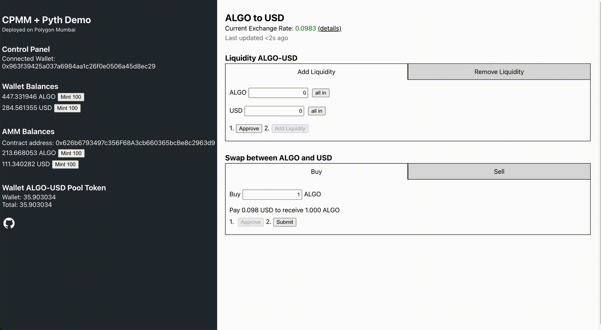
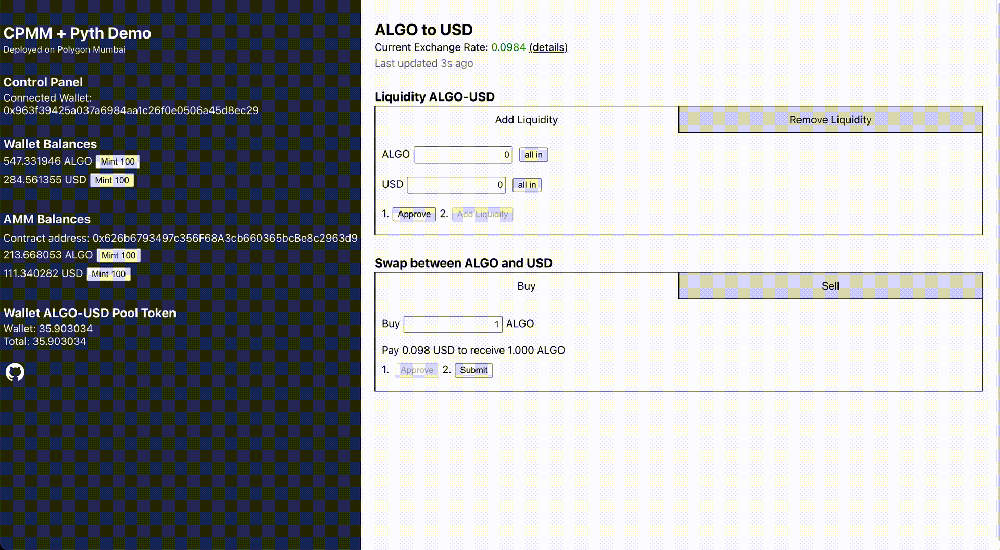
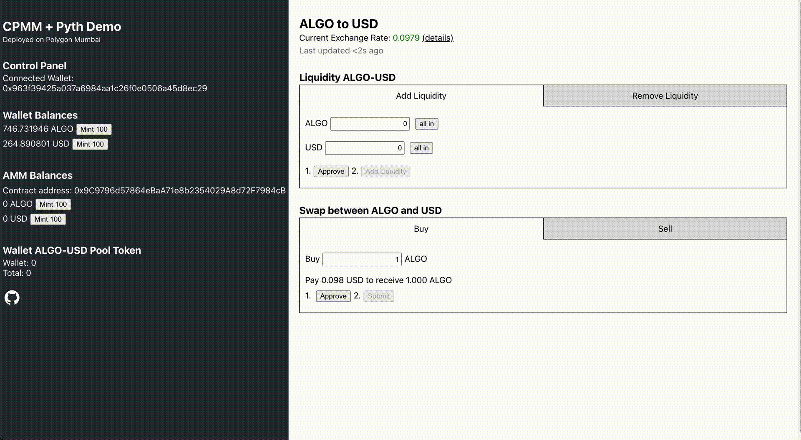
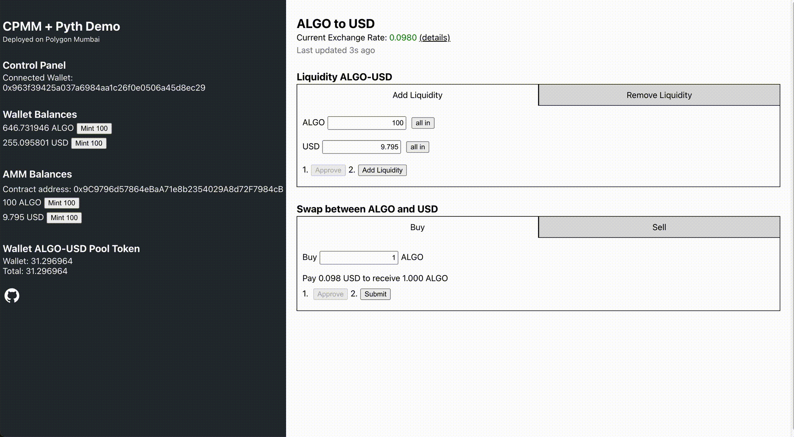

# Pyth Oracle AMM with Liquidity Pool

Modification of [Oracle Swap Example](https://github.com/pyth-network/pyth-crosschain/tree/main/target_chains/ethereum/examples/oracle_swap) from Pyth Network

This directory contains an example oracle AMM application using Pyth price 
feeds.

#### Swap
The oracle AMM manages a pool of two tokens and allows a user to trade with the pool at the current Pyth price. A fee of 0.3% is introduced to incentivize liquidity provider.

#### Liquidity Pool
Liquidity Pool with constant production relation of two tokens is connected to the swap. However, trades in swap are at current Pyth price, regardless of the supply of the tokens in the liquidity pool. Thus, the pool is price insensitive and vulnerable to price fluctuation in the market.

Alternatively, liquidity pool token can be calculated with the current value of the tokens deposited against the current market value of the existing liquidity pool. However, the proportion of value of one token against other another may skew as swap continues. Additional measures of pool balancing shall be introduced. [1]

#### Project Structure
This application has two components. The first component is a smart contract (in the `contract` directory) that manages the pool and implements the trading functionality.
The second is a frontend application (in the `app` directory) that communicates with the smart contract.

Please see the [Pyth documentation](https://docs.pyth.network/documentation/pythnet-price-feeds) for more information about Pyth and how to integrate it into your application.

**Warning** this AMM is intended only as a demonstration of Pyth price feeds and is **not for production use**.

## AMM Contract

All of the commands in this section expect to be run from the `contract` directory.

### Building

You need to have [Foundry](https://getfoundry.sh/) and `node` installed to run this example.
Once you have installed these tools, run the following commands from the [`contract`](./contract) directory:

```
forge install foundry-rs/forge-std@2c7cbfc6fbede6d7c9e6b17afe997e3fdfe22fef --no-git --no-commit
forge install pyth-network/pyth-sdk-solidity@v2.2.0 --no-git --no-commit
forge install OpenZeppelin/openzeppelin-contracts@v4.8.1 --no-git --no-commit
```

### Testing

Simply run `forge test` in the [`contract`](./contract) directory. This command will run the
tests located in the [`contract/test`](./contract/test) directory.

### Deploying

To deploy the contract, you first need to configure the target network and the tokens in the AMM pool.
Edit the configuration parameters in the [deploy script](./contract/scripts/deploy.sh) and then run it using `./scripts/deploy.sh`.
The code comments in that file should help you populate the parameters correctly.

If you don't have ERC-20 tokens to test with, you can use the [token deploy script](./contract/scripts/deploy_token.sh) to create some for testing.
Edit the configuration parameters in there before running to set the network and token name.
This will deploy a new mock token and print out a contract address.
Once you have this address, you can mint the token anytime using the following command:

```
cast send --rpc-url <RPC_URL> -l <ERC20_CONTRACT_ADDRESS> "mint(address,uint256)" <YOUR_WALLET_ADDRESS> <QUANTITY_IN_WEI>
```

When the contract is deployed, the token pools are initially empty.
You will need to send some funds to the pool for testing purposes.
You can use the following command to transfer ERC-20 tokens from your wallet to the contract:

```
cast send --rpc-url <RPC_URL> -l <ERC20_CONTRACT_ADDRESS> "transfer(address,uint256)" <DESTINATION_ADDRESS> <QUANTITY_IN_WEI>
```

### Create ABI

If you change the contract, you will need to create a new ABI.
The frontend uses this ABI to create transactions.
You can overwrite the existing ABI by running the following command:

```
forge inspect OracleSwap abi > ../app/src/abi/OracleSwapAbi.json
```

## Frontend Application

By default, the frontend is configured to use the already deployed version of the oracle AMM
at address [`0x9C9796d57864eBaA71e8b2354029A8d72F7984cB`](https://mumbai.polygonscan.com/address/0x9C9796d57864eBaA71e8b2354029A8d72F7984cB) on Polygon Mumbai.
This means you can start playing with the application without going through the steps above (Remember to switch your wallet to Mumbai and to claim funds from a faucet to pay for the gas).

### Build

From the root of the pyth-crosschain repository, run:

```
npm ci
npx lerna run build
```

This command will install dependencies for all packages within the typescript monorepo, and also build some
typescript SDKs that this example depends on.

### Run

After building, you can start the frontend by navigating to the `app/` directory and running:

`npm run start`

Then navigate your browser to `localhost:3000`.

## Deployed Demo
Demo:
[link](https://pyth-oracle-swap-demo.netlify.app/)


```
REACT_APP_CONTRACT_NETWORK='Polygon Mumbai'


REACT_APP_BASE_TOKEN_NAME=ALGO
REACT_APP_BASE_TOKEN_ERC20_ADDRESS=0xB3a2EDFEFC35afE110F983E32Eb67E671501de1f
REACT_APP_BASE_TOKEN_PYTH_ADDRESS=08f781a893bc9340140c5f89c8a96f438bcfae4d1474cc0f688e3a52892c7318
REACT_APP_BASE_TOKEN_DECIMALS=18

REACT_APP_QUOTE_TOKEN_NAME=USD
REACT_APP_QUOTE_TOKEN_ERC20_ADDRESS=0x8C65F3b18fB29D756d26c1965d84DBC273487624
REACT_APP_QUOTE_TOKEN_PYTH_ADDRESS=1fc18861232290221461220bd4e2acd1dcdfbc89c84092c93c18bdc7756c1588
REACT_APP_QUOTE_TOKEN_DECIMALS=18

REACT_APP_SWAP_ADDERESS=0x626b6793497c356F68A3cb660365bcBe8c2963d9
REACT_APP_PYTH_ADDRESS=0xff1a0f4744e8582DF1aE09D5611b887B6a12925C
REACT_APP_PYTH_SERVICE_URL=https://xc-testnet.pyth.network

```

### Mint

---
Mint tokens to your wallet or to the Swap Contract for testing the functions



### Swap

---


### Add Liquidity

---


### Remove Liquidity



---

[1]: LIFINITY protocol: Proactive market maker with concentrated liquidity [(website)](https://lifinity.io/)
